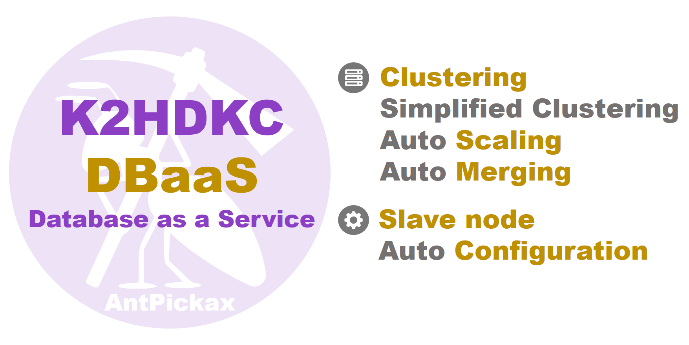

# **K2HDKC DBaaS**
**K2HDKC DBaaS** (Database as a Service for K2HDKC) is a **Database as a Service** that uses [K2HR3](https://k2hr3.antpick.ax/) and works with [OpenStack](https://www.openstack.org/) and [kubernetes](https://kubernetes.io/) to build a [K2HDKC(K2Hash based Distributed Kvs Cluster)](https://k2hdkc.antpick.ax/index.html) Cluster for distributed KVS.  

We have **two** products for **K2HDKC DBaaS** (Database as a Service for K2HDKC) that cooperates with [OpenStack](https://www.openstack.org/).  

One is **K2HDKC DBaaS** that can be operated from [Trove(Trove is Database as a Service for OpenStack)](https://wiki.openstack.org/wiki/Trove) by incorporating `K2HDKC` as one of the databases managed by [Trove](https://wiki.openstack.org/wiki/Trove).  

The other is a **command line tool** called **K2HDKC DBaaS CLI** (Command Line Interface) that allows you to build up `K2HDKC` cluster directly without using [Trove](https://wiki.openstack.org/wiki/Trove).  

It also provides a **command line tool** called **K2HDKC DBaaS on kubernetes CLI** (Command Line Interface) for building up `K2HDKC` clusters inside [kubernetes](https://kubernetes.io/) clusters.  

**K2HDKC DBaaS** is one of [AntPickax](https://antpick.ax/)'s open source product by Yahoo! JAPAN.  

## {{ page.arrow_link_overview }}
[Overview](overview.html) about **K2HDKC DBaaS**.  

Below is an overview of each type of **K2HDKC DBaaS**.  

- [K2HDKC DBaaS with Trove](overview_trove.html)  
An overview of **K2HDKC DBaaS** (Database as a Service for K2HDKC) that works with [Trove(Trove is Database as a Service for OpenStack)](https://wiki.openstack.org/wiki/Trove).
- [K2HDKC DBaaS CLI](overview_cli.html)  
An overview of **K2HDKC DBaaS** (Database as a Service for K2HDKC) that works with [OpenStack](https://www.openstack.org/).
- [K2HDKC DBaaS on kubernetes CLI](overview_k8s_cli.html)  
An overview of **K2HDKC DBaaS** (Database as a Service for K2HDKC) that works with [kubernetes](https://kubernetes.io/).
- [K2HDKC Helm Chart](overview_helm_chart.html)  
An overview of **K2HDKC DBaaS** (Database as a Service for K2HDKC) that uses [Helm(The package manager for Kubernetes)](https://helm.sh/) and works with [kubernetes](https://kubernetes.io/).

## {{ page.arrow_link_whatnew }}
What's new about **K2HDKC DBaaS**.

## {{ page.arrow_link_build }}

Each **K2HDKC DBaaS** source code is in the [Github](https://github.com/) repository shown below.  

- [k2hdkc_dbaas repository](https://github.com/yahoojapan/k2hdkc_dbaas)  
The source code repository for [K2HDKC DBaaS with Trove](overview_trove.html)
- [k2hdkc_dbaas_cli repository](https://github.com/yahoojapan/k2hdkc_dbaas_cli)  
The source code repository for [K2HDKC DBaaS CLI](overview_cli.html) (Command Line Interface)  
- [k2hdkc_dbaas_k8s_cli repository](https://github.com/yahoojapan/k2hdkc_dbaas_k8s_cli)  
The source code repository for [K2HDKC DBaaS on kubernetes CLI](overview_k8s_cli.html) (Command Line Interface)  
- [k2hdkc_helm_chart repository](https://github.com/yahoojapan/k2hdkc_helm_chart)  
The source code repository for [K2HDKC Helm Chart](overview_helm_chart.html)  

## {{ page.arrow_link_usage }}

How to use all **K2HDKC DBaaS** is explained in [Usage](usage.html).  

You can also refer directly to the links below for how to use each **K2HDKC DBaaS**.  

- [Usage for K2HDKC DBaaS](usage.html) with [Trove](https://wiki.openstack.org/wiki/Trove)
- [Usage for K2HDKC DBaaS CLI](usage_cli.html) (Command Line Interface)
- [Usage for K2HDKC DBaaS on kubernetes CLI](usage_k8s_cli.html) (Command Line Interface)
- [Usage for K2HDKC Helm Chart](usage_helm_chart.html)

# About AntPickax
[AntPickax](https://antpick.ax/) is product group that is provided as open source by Yahoo! JAPAN.  
Please see the [AntPickax](https://antpick.ax/) details page.
