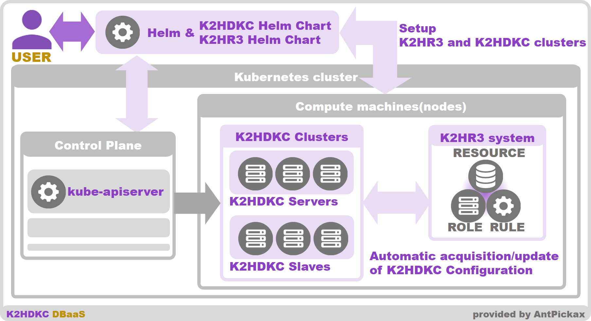

# K2HDKC Helm Chart Overview
**K2HDKC Helm Chart** is one of **Helm Chart** for building a K2HDKC cluster as **DBaaS(Database as a Service)** using [Helm(The package manager for Kubernetes)](https://helm.sh/) in [kubernetes](https://kubernetes.io/).  

**K2HDKC Helm Chart** makes it easy to build a **K2HDKC cluster** as a **K2HDKC DBaaS** into a kubernetes environment.  
**K2HDKC Helm Chart** is one of **Helm Chart** that supports [Helm(The package manager for Kubernetes)](https://helm.sh/).  

[K2HR3](https://k2hr3.antpick.ax/index.html) system is required to use and build **K2HDKC DBaaS**.  

This [K2HR3](https://k2hr3.antpick.ax/index.html) system can also be easily built using [Helm](https://helm.sh/).  
[K2HR3 Helm Chart](https://k2hr3.antpick.ax/helm_chart.html) which is one of **Helm Chart**, it setups(installs) **K2HR3** system into kubernetes environment.  
See [K2HR3 Helm Chart](https://k2hr3.antpick.ax/k2hr3_helm_chart.html) for information on how to build a **K2HR3** system.  

Below is a description of the **K2HDKC DBaaS** system using the **K2HDKC Helm Chart**.  

## About Helm
**K2HDKC Helm Chart** is one of **Helm Chart** used by [Helm(The package manager for Kubernetes)](https://helm.sh/).  

**K2HDKC Helm Chart** is published on [Artifact Hub](https://artifacthub.io/packages/helm/k2hdkc/k2hdkc) and can be used from anywhere.  

See the [Helm](https://helm.sh/) documentation for usage and more information.  
See [Usage - K2HDKC Helm Chart](usage_helm_chart.html) for information on how to build a **K2HDKC cluster** using the **Helm command**.  

### To kubernetes control plane
The **Helm command** uses **kube-apiserver** of [kubernetes](https://kubernetes.io/) Control Plane and **CRD(Custom Resource Definitions)** to build kubernetes **resources** according to **Helm Chart**.  
The **K2HDKC Helm Chart** specifies the kubernetes **resources** required for **K2HDKC DBaaS**, which is used by **Helm command**.  

See the [Helm](https://helm.sh/) documentation for more information.  

## K2HR3 System
As mentioned earlier, the **K2HDKC Helm Chart** requires the [K2HR3](https://k2hr3.antpick.ax/index.html) system which is one of the [AntPickax](https://antpick.ax/index.html) products, like other types of K2HDKC DBaaS.  
Before using **K2HDKC Helm Chart**, you need to setup(build) [K2HR3](https://k2hr3.antpick.ax) system by using [K2HR3 Helm Chart](https://k2hr3.antpick.ax/helm_chart.html).  

Please refer to [Usage - K2HR3 Helm Chart](https://k2hr3.antpick.ax/setup_helm_chart.html) for how to use [K2HR3 Helm Chart](https://k2hr3.antpick.ax/helm_chart.html).  

## K2HDKC Cluster
You can build all parts for K2HDKC cluster(server / slave nodes) by **K2HDKC Helm Chart** easily.  
These nodes of K2HDKC cluster are launched as container on **Compute machie (nodes)** in [kubernetes](https://kubernetes.io/) cluster.  

You can give some **options** for **helm command**(`helm install`), thus it allows you to launch customized nodes and K2HDKC cluster you want.  
For example, it can specify the number of server nodes(number of containers), port number, etc. of the K2HDKC cluster to launch.  

You can also specify a program to run in the slave node of the K2HDKC cluster.  
The specified **slave program** can be launched as a container as a K2HDKC slave node.  

By using **K2HDKC Helm Chart**, you don't need to prepare a complicated manifest file(yaml file) for building a K2HDKC cluster.  
And the **options** you pass to the **Helm command** allow you for pre-prepared customization by this Helm Chart.  

