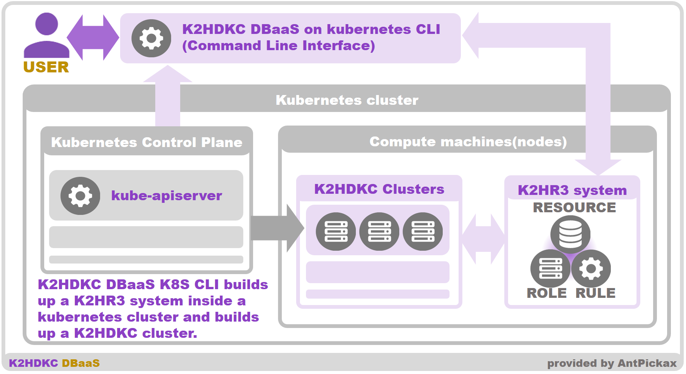
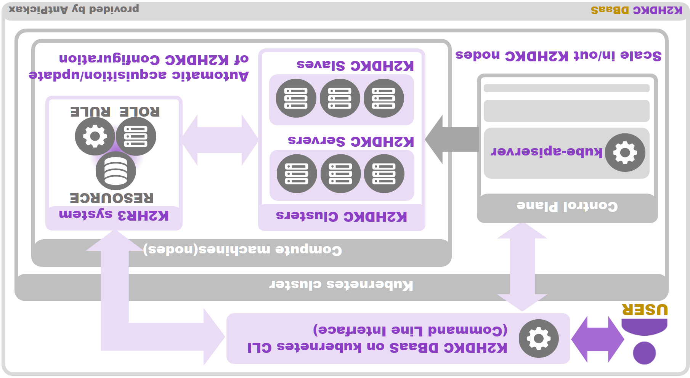

# Overview - K2HDKC DBaaS on kubernetes CLI
**K2HDKC DBaaS on kubernetes CLI** (Command Line Interface) makes it easy to build a **K2HDKC** cluster as **DBaaS(Database as a Service)** within a [kubernetes](https://kubernetes.io/) cluster.  

All construction and operation of K2HDKC cluster and [K2HR3](https://k2hr3.antpick.ax/index.html) system as **K2HDKC DBaaS** can be executed from **K2HDKC DBaaS on kubernetes CLI**.  

The [K2HR3](https://k2hr3.antpick.ax/index.html) system required for **K2HDKC DBaaS** must be built in a [kubernetes](https://kubernetes.io/) cluster.  
First of all, build a [K2HR3](https://k2hr3.antpick.ax/index.html) system in a [kubernetes](https://kubernetes.io/) cluster.  
This operation is easy to do using the **K2HDKC DBaaS on kubernetes CLI**.  
**K2HDKC DBaaS on kubernetes CLI** allows you to build and delete [K2HR3](https://k2hr3.antpick.ax/index.html) systems in your [kubernetes](https://kubernetes.io/) cluster.  

Use the built [K2HR3](https://k2hr3.antpick.ax/index.html) system to build and delete the **K2HDKC cluster**.  
**K2HDKC DBaaS on kubernetes CLI** can be used to scale in/out server nodes to a K2HDKC cluster.  
You can scale in/out slave nodes that connect to the built K2HDKC cluster in the same way.  
Automatic configuration and automatic data merging are supported as these operations increase or decrease the number of nodes in the K2HDKC cluster.  

Below is a rough description of the **K2HDKC DBaaS** system using the **K2HDKC DBaaS on kubernetes CLI**.  

## kubernetes control plane
**K2HDKC DBaaS on kubernetes CLI** uses **kube-apiserver** of Control Plane in [kubernetes](https://kubernetes.io/) cluster.  
**K2HDKC DBaaS on kubernetes CLI** can work with existing your [kubernetes](https://kubernetes.io/) clusters.  

At this time, the [kubernetes](https://kubernetes.io/) cluster authentication system only supports [OpenID Connect](https://openid.net/connect/).  

## K2HR3 system
Similar to **K2HDKC DBaaS** which works with [OpenStack](https://www.openstack.org/), this type requires the [K2HR3](https://k2hr3.antpick.ax/) system which is one of the [AntPickax](https://antpick.ax/index.html) products.  
**K2HDKC DBaaS on kubernetes CLI** manipulates [K2HR3](https://k2hr3.antpick.ax/) system and [kubernetes](https://kubernetes.io/) resources to realize **K2HDKC DBaaS** function.  

This [K2HR3](https://k2hr3.antpick.ax/index.html) system must be in a same [kubernetes](https://kubernetes.io/) cluster that builds **K2HDKC DBaaS**.  

You can build the [K2HR3](https://k2hr3.antpick.ax/index.html) system required by **K2HDKC DBaaS** using **K2HDKC DBaaS on kubernetes CLI**.  
The required [K2HR3](https://k2hr3.antpick.ax/index.html) system configuration is set automatically by **K2HDKC DBaaS on kubernetes CLI**.  

It is sufficient to have one [K2HR3](https://k2hr3.antpick.ax/index.html) system in a [kubernetes](https://kubernetes.io/) cluster, but you can build multiple [K2HR3](https://k2hr3.antpick.ax/index.html) systems.  

## K2HDKC cluster
This is a K2HDKC cluster built and launched by the **K2HDKC DBaaS on kubernetes CLI**.  
On **Compute machie(nodes)** in the [kubernetes](https://kubernetes.io/) cluster, each node in the K2HDKC cluster is launched as a container.  

**K2HDKC DBaaS on kubernetes CLI** can be used to create/delete(scale in/out) server nodes and slave nodes of a K2HDKC cluster.  
(You can also scale directly using the **kubectl** command etc.)  

## K2HDKC slave node
This is the slave nodes(clients) that connect to server nodes in K2HDKC cluster created by **K2HDKC DBaaS on kubernetes CLI**.  

K2HDKC slave nodes can also be created and deleted using **K2HDKC DBaaS on kubernetes CLI**.  
And **K2HDKC DBaaS on kubernetes CLI** supports automatic configuration for these nodes.  

The [kubernetes](https://kubernetes.io/) object used to build the K2HDKC slave node is represented as a **yaml file**.  
Users modify this **yaml file template** used by the **K2HDKC DBaaS on kubernetes CLI** and change it to the container they need.  

**K2HDKC DBaaS on kubernetes CLI** hides the K2HDK cluster configuration from the K2HDKC slave node programs, and these programs eliminate the need to be aware of the server node configuration, reducing the load on developers and operators.  
