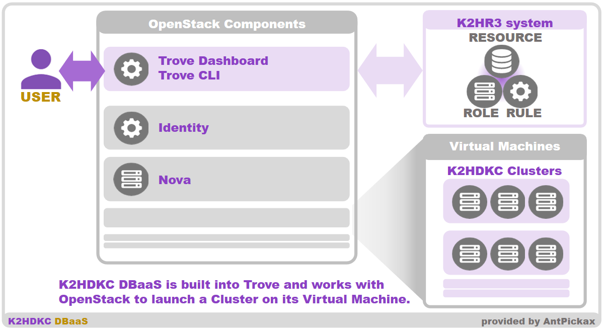
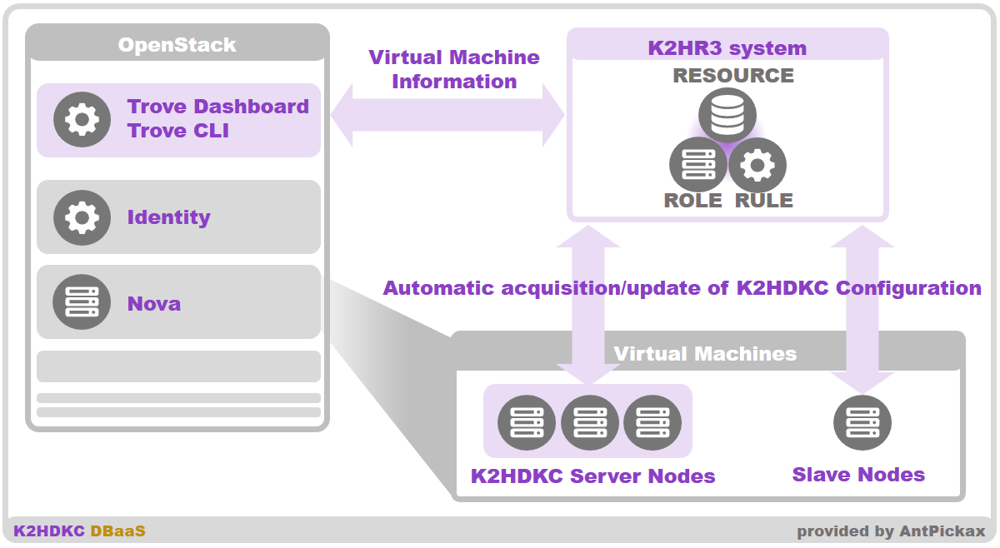
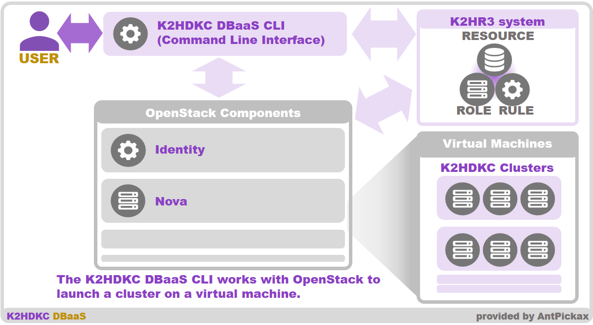
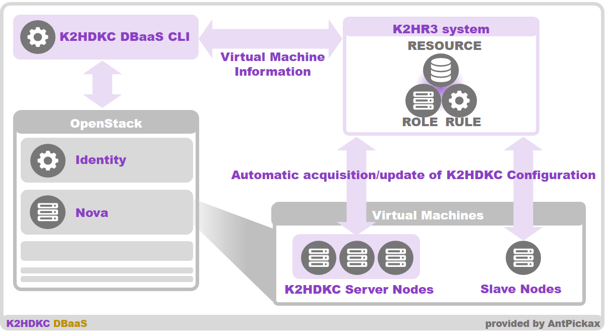

# **K2HDKC DBaaS**
**K2HDKC DBaaS** (Database as a Service for K2HDKC) は、[K2HR3](https://k2hr3.antpick.ax/indexja.html)を使い、[OpenStack](https://www.openstack.org/) および [kubernetes](https://kubernetes.io/)と連動して、分散KVSである [K2HDKC](https://k2hdkc.antpick.ax/indexja.html) の環境を構築する**Database as a Service**です。

## 背景
Yahoo! JAPANがオープンソースとして公開する一連のプロダクト群の[AntPickax](https://antpick.ax/indexja.html)は、分散KVSである [K2HDKC](https://k2hdkc.antpick.ax/indexja.html) を公開しています。  
この [K2HDKC](https://k2hdkc.antpick.ax/indexja.html) を簡単に利用できるように、DBaaS（Database as a Service）として提供することを計画しました。  
そして、公開されている[K2HR3](https://k2hr3.antpick.ax/indexja.html)は、これを実現するために十分な機能を提供しています。  
私たちは、この[K2HR3](https://k2hr3.antpick.ax/indexja.html)を中心に、[OpenStack](https://www.openstack.org/) および [kubernetes](https://kubernetes.io/)と連動して**DBaaS（Database as a Service）**を実現しました。  

**K2HDKC DBaaS** (Database as a Service for K2HDKC) は、以下の[AntPickax](https://antpick.ax/indexja.html)プロダクトを使い、構成されています。

### [K2HDKC](https://k2hdkc.antpick.ax/indexja.html) - K2Hash based Distributed Kvs Cluster
分散KVSであり、**K2HDKC DBaaS**の核となるプロダクトです。
### [CHMPX](https://chmpx.antpick.ax/indexja.html) - Consistent Hashing Mq inProcess data eXchange
ネットワークを跨ぐプロセス間におけるバイナリ通信を行うための通信ミドルウエアであり、[K2HDKC](https://k2hdkc.antpick.ax/indexja.html)が内部で利用します。
### [K2HR3](https://k2hr3.antpick.ax/indexja.html) - K2Hdkc based Resource and Roles and policy Rules
RBAC (Role Based Access Control) システムであり、**K2HDKC DBaaS** で作成されるK2HDKCクラスターの構成を管理します。

# 概要
**K2HDKC DBaaS** (Database as a Service for K2HDKC) が提供する **DBaaS（Database as a Service）** は、[OpenStack](https://www.openstack.org/)と連動するために**2つの方法**を提供します。  
また、[kubernetes](https://kubernetes.io/)と連動するために**1つの方法**を提供します。

## Trove(Trove is Database as a Service for OpenStack) 対応
[OpenStack](https://www.openstack.org/) のプロダクトである [Trove(Trove is Database as a Service for OpenStack)](https://wiki.openstack.org/wiki/Trove) を使った**DBaaS（Database as a Service）**です。  
これは、[Trove(Trove is Database as a Service for OpenStack)](https://wiki.openstack.org/wiki/Trove)のひとつのデータベース（分散KVS）として、[K2HDKC](https://k2hdkc.antpick.ax/indexja.html) を組み込み、DBaaSを実現します。  

## OpenStackとK2HDKC DBaaS CLI（Command Line Interface）
[OpenStack](https://www.openstack.org/)の環境を持っていることを前提とし、**K2HDKC DBaaS CLI（Command Line Interface）**を使って、**DBaaS（Database as a Service）**が実現できます。

## K2HDKC DBaaS on kubernetes CLI（Command Line Interface）
すでに利用している[kubernetes](https://kubernetes.io/)クラスターがあれば、**K2HDKC DBaaS CLI（Command Line Interface）**を使って、**DBaaS（Database as a Service）**が実現できます。

# Trove(Trove is Database as a Service for OpenStack) 概要
[Trove(Trove is Database as a Service for OpenStack)](https://wiki.openstack.org/wiki/Trove)の一つのDatabaseとして提供される **K2HDKC DBaaS** (Database as a Service for K2HDKC) は、[OpenStack](https://www.openstack.org/) のコンポーネントと連携し、**DBaaS（Database as a Service）**としての機能を提供します。  

**K2HDKC DBaaS** でK2HDKCクラスター構築などの操作は、すべてDashboard（Trove Dashboard）もしくは、Trove CLI（openstackコマンド）から実行できます。  
K2HDKCクラスターの構築、削除、クラスターへサーバーノードの追加・削除（スケール）、バックアップ、リストアの操作ができます。  
また、ユーザが **K2HDKC DBaaS** で構築したK2HDKCクラスターへ簡単に接続し、利用できるようにするため、K2HDKCスレーブノードの起動、自動コンフィグレーションをサポートします。  

**K2HDKC DBaaS** の大まかなシステムの説明をします。  

## OpenStack コンポーネント
**K2HDKC DBaaS** には、OpenStackのコンポーネントが必要となります。  
OpenStackの各コンポーネントおよび全体の構築はユーザが行います。  
既存のOpenStackに、**K2HDKC DBaaS** を組み込むことも可能です。  
Trove は、OpenStack コンポーネントのひとつであり、**K2HDKC DBaaS** は、TroveのDatabaseのひとつとして組み込まれています。  
つまり、このTroveのタイプの**K2HDKC DBaaS**は、TroveのDatabaseの種類にK2HDKCを拡張したシステムです。  
**K2HDKC DBaaS**の基本的な仕様は、すべてTroveに従っており、Troveの操作でDBaaSとしての操作・動作を行えます。  

## K2HR3 システム
**K2HDKC DBaaS**は、[AntPickax](https://antpick.ax/indexja.html)プロダクトの一つである [K2HR3](https://k2hr3.antpick.ax/indexja.html) システムを必要とします。  
[K2HR3](https://k2hr3.antpick.ax/indexja.html) システムとTroveが連携し、DBaaS機能を実現しています。  
[K2HR3](https://k2hr3.antpick.ax/indexja.html)は、OpenStackと連携できるように設計されており、バックエンドのシステムとしてTroveと連携します。  

[K2HR3](https://k2hr3.antpick.ax/indexja.html)システムは、OpenStackのコンポーネントやインスタンス（`Virtual Machine`）からアクセスできるネットワーク環境に構築する必要があります。  
例えば、ネットワーク内で到達できる環境であればよいため、**K2HDKC DBaaS**と連携するOpenStackが作成するインスタンス（`Virtual Machine`）の中で起動することもできます。  

## K2HDKC クラスター
これは、**K2HDKC DBaaS** が構築し、起動するK2HDKCのクラスターです。  
OpenStackの管理する複数のインスタンス（`Virtual Machine`）でK2HDKCサーバーノードが起動され、クラスターを構成します。  
**K2HDKC DBaaS** の機能は、このK2HDKCクラスターの構築、破棄、制御（スケール、データマージ）することです。  

## K2HDKC スレーブノード
**K2HDKC DBaaS**により作成されたK2HDKCクラスター（サーバーノード）に接続するノード（クライアント）のことです。

K2HDKCスレーブノードは、手動で設定し、起動できます。  
しかし、**K2HDKC DBaaS** の機能を使うことにより、自動的なコンフィグレーションをサポートできます。  
このためには、**K2HDKC DBaaS** と連携しているOpenStackのインスタンス（`Virtual Machine`）をK2HDKCのスレーブノードとして起動します。
このインスタンス（`Virtual Machine`）を起動するときに、[K2HR3](https://k2hr3.antpick.ax/indexja.html)が提供する `User Data Script for OpenStack`データを使用します。  
起動後のインスタンス（`Virtual Machine`）は、[K2HR3](https://k2hr3.antpick.ax/indexja.html)システムと連動します。  
その結果、K2HDKCクラスターに接続するために必要なK2HDKC設定や、K2HDKCスレーブノードに必要なすべてのパッケージがインストール・設定され、K2HDKCスレーブノードの管理の自動化ができます。  

このように起動したK2HDKCスレーブノードは、K2HDKCサーバーノードのスケールに応じて、接続・切断などの処理を自動化することができます。  
そして、K2HDKCスレーブノード上のユーザのプログラムから、K2HDKクラスターの構成を隠蔽し、ユーザのプログラムはサーバーノードの構成を意識する必要がなくなり、開発者・運用者の負荷を低減できます。

# K2HDKC DBaaS CLI（Command Line Interface） 概要
**K2HDKC DBaaS CLI（Command Line Interface）**を使った**DBaaS（Database as a Service）**は、[Trove(Trove is Database as a Service for OpenStack)](https://wiki.openstack.org/wiki/Trove)を**必要とせず**、[OpenStack](https://www.openstack.org/) のコンポーネントとのみ連携します。  
既に[OpenStack](https://www.openstack.org/)環境を持っており、[Trove(Trove is Database as a Service for OpenStack)](https://wiki.openstack.org/wiki/Trove)コンポーネントを組み込むことが困難な環境において、**DBaaS（Database as a Service）**としての機能を実現できます。  

**K2HDKC DBaaS** でK2HDKCクラスター構築などの操作は、すべてK2HDKC DBaaS CLI（Command Line Interface）から実行できます。  
K2HDKCクラスターの構築、削除、クラスターへサーバーノードの追加・削除（スケール）の操作ができます。  
また、構築した K2HDKCクラスターへ簡単に接続し、利用できるようにするため、K2HDKCスレーブノードの起動、自動コンフィグレーションをサポートします。  

**K2HDKC DBaaS CLI（Command Line Interface）** による**DBaaS（Database as a Service）**の大まかなシステムの説明をします。  

## OpenStack コンポーネント
**K2HDKC DBaaS CLI** は、OpenStackのコンポーネントと連携します。  
このOpenStackのコンポーネントは、既にあるシステムを想定しており、インスタンス（`Virtual Machine`）を起動できる環境であれば、**K2HDKC DBaaS CLI**は連携できます。  

## K2HR3 システム
Troveタイプの **K2HDKC DBaaS**と同様に、[AntPickax](https://antpick.ax/indexja.html)プロダクトの一つである [K2HR3](https://k2hr3.antpick.ax/indexja.html) システムを必要とします。  

**K2HDKC DBaaS CLI**が、[K2HR3](https://k2hr3.antpick.ax/indexja.html) システム、[OpenStack](https://www.openstack.org/)のコンポーネントを操作し、DBaaS機能を実現しています。  

また、Troveタイプと同様に、[K2HR3](https://k2hr3.antpick.ax/indexja.html)システムは、OpenStackのコンポーネントやインスタンス（`Virtual Machine`）からアクセスできるネットワーク環境に構築する必要があります。  
例えば、ネットワーク内で到達できる環境であればよいため、**K2HDKC DBaaS**と連携するOpenStackが作成するインスタンス（`Virtual Machine`）の中で起動することもできます。  

## K2HDKC クラスター
これは、**K2HDKC DBaaS CLI** が構築し、起動するK2HDKCのクラスターです。  
OpenStackの管理する複数のインスタンス（`Virtual Machine`）でK2HDKCサーバーノードが起動され、クラスターを構成します。  
**K2HDKC DBaaS CLI** の機能は、このK2HDKCクラスターの構築、破棄、制御（スケール、データマージ）することです。  

## K2HDKC スレーブノード
**K2HDKC DBaaS CLI**により作成されたK2HDKCクラスター（サーバーノード）に接続するノード（クライアント）のことです。

K2HDKCスレーブノードも、**K2HDKC DBaaS CLI**を使い、起動できます。  
そして、**K2HDKC DBaaS CLI** により、自動的なコンフィグレーションがサポートされます。  
K2HDKCスレーブノードは、**K2HDKC DBaaS CLI** により起動されるOpenStackのインスタンス（`Virtual Machine`）です。  
K2HDKCスレーブノードのインスタンス（`Virtual Machine`）は、[K2HR3](https://k2hr3.antpick.ax/indexja.html)が提供する `User Data Script for OpenStack`データを使用します。  
また、インスタンス（`Virtual Machine`）は、[K2HR3](https://k2hr3.antpick.ax/indexja.html)システムと連動しており、K2HDKCクラスターに接続するために必要なK2HDKC設定や、K2HDKCスレーブノードに必要なすべてのパッケージがインストール・設定され、K2HDKCスレーブノードの管理の自動化ができます。  

Troveタイプと同様に、起動したK2HDKCスレーブノードは、K2HDKCサーバーノードのスケールに応じて、接続・切断などの処理を自動化することができます。  
そして、K2HDKCスレーブノード上のユーザのプログラムから、K2HDKクラスターの構成を隠蔽し、ユーザのプログラムはサーバーノードの構成を意識する必要がなくなり、開発者・運用者の負荷を低減できます。

# K2HDKC DBaaS on kubernetes CLI（Command Line Interface） 概要
**K2HDKC DBaaS on kubernetes CLI（Command Line Interface）**を使うと[kubernetes](https://kubernetes.io/) クラスター内に簡単に **K2HDKC**クラスターを**DBaaS（Database as a Service）**として構築できます。  

**K2HDKC DBaaS** でK2HDKCクラスター構築、[K2HR3](https://k2hr3.antpick.ax/indexja.html)システムの構築の操作は、すべて **K2HDKC DBaaS on kubernetes CLI** から実行できます。  

**K2HDKC DBaaS** に必要となる [K2HR3](https://k2hr3.antpick.ax/indexja.html)システムは、[kubernetes](https://kubernetes.io/) クラスター内に構築されている必要があります。  
まず最初に、[kubernetes](https://kubernetes.io/) クラスター内に[K2HR3](https://k2hr3.antpick.ax/indexja.html)システムを構築します。  
この操作は、**K2HDKC DBaaS on kubernetes CLI** を使い、簡単に実行できます。  
**K2HDKC DBaaS on kubernetes CLI** は、[kubernetes](https://kubernetes.io/) クラスター内の[K2HR3](https://k2hr3.antpick.ax/indexja.html)システムの構築・削除ができます。  

構築した[K2HR3](https://k2hr3.antpick.ax/indexja.html)システムを使い、**K2HDKCクラスター** の構築、削除を行います。  
K2HDKCクラスターへサーバーノードの追加・削除（スケール）の操作も、**K2HDKC DBaaS on kubernetes CLI** から操作できます。  
構築した K2HDKCクラスターに接続するK2HDKCスレーブノードの起動・追加・削除も同様に操作できます。  
これらの操作によるK2HDKCクラスターノードの増減に対して、自動的なコンフィグレーションおよび自動データマージがサポートされます。  

**K2HDKC DBaaS on kubernetes CLI** による**DBaaS（Database as a Service）**の大まかなシステムの説明をします。  

## kubernetes control plane
**K2HDKC DBaaS on kubernetes CLI** は、[kubernetes](https://kubernetes.io/) クラスター Control Planeの **kube-apiserver** を使います。  
**K2HDKC DBaaS on kubernetes CLI** は、既存の[kubernetes](https://kubernetes.io/) クラスターと連携します。  

現時点で、[kubernetes](https://kubernetes.io/) クラスターの認証システムは、[OpenID Connect](https://openid.net/connect/)のみサポートしてます。  

## K2HR3 システム
[OpenStack](https://www.openstack.org/)と連動するタイプの **K2HDKC DBaaS**と同様に、[AntPickax](https://antpick.ax/indexja.html)プロダクトの一つである [K2HR3](https://k2hr3.antpick.ax/indexja.html) システムを必要とします。  
**K2HDKC DBaaS on kubernetes CLI**が、[K2HR3](https://k2hr3.antpick.ax/indexja.html) システム、[kubernetes](https://kubernetes.io/)のリソースを操作し、DBaaS機能を実現しています。  

この[K2HR3](https://k2hr3.antpick.ax/indexja.html) システムは、**K2HDKC DBaaS**を構築する[kubernetes](https://kubernetes.io/)クラスター内に存在する必要があります。  

**K2HDKC DBaaS**が必要とする[K2HR3](https://k2hr3.antpick.ax/indexja.html) システムを、**K2HDKC DBaaS on kubernetes CLI**を使って、構築できます。  
必要とされる[K2HR3](https://k2hr3.antpick.ax/indexja.html) システムのコンフィグレーションは、自動的に設定されます。  

[K2HR3](https://k2hr3.antpick.ax/indexja.html) システムは、[kubernetes](https://kubernetes.io/)クラスター内に１つ存在すれば十分ですが、複数構築することもできます。  

## K2HDKC クラスター
これは、**K2HDKC DBaaS on kubernetes CLI** が構築し、起動するK2HDKCのクラスターです。  
[kubernetes](https://kubernetes.io/)クラスター内の **Compute machie(nodes)**上に、K2HDKCのクラスターの各ノードはコンテナーとして起動されます。  

**K2HDKC DBaaS on kubernetes CLI**を使って、K2HDKCのクラスターのサーバーノード、スレーブノードの作成・削除（スケール）を行うことができます。  
（直接、kubectlコマンドなどを使ってスケールすることもできます。）  

## K2HDKC スレーブノード
**K2HDKC DBaaS on kubernetes CLI**により作成されたK2HDKCクラスター（サーバーノード）に接続するノード（クライアント）のことです。  

K2HDKCスレーブノードも、**K2HDKC DBaaS on kubernetes CLI**を使い、起動・削除できます。  
そして、**K2HDKC DBaaS on kubernetes CLI** により、自動的なコンフィグレーションがサポートされます。  

K2HDKCスレーブノードの構築に使われる[kubernetes](https://kubernetes.io/)オブジェクトは、**yamlファイル**として表現されています。  
ユーザは、**K2HDKC DBaaS on kubernetes CLI**が使う**yamlファイルのテンプレート**を変更し、自分たちに必要なコンテナーに変更して利用します。  

**K2HDKC DBaaS on kubernetes CLI** により、K2HDKCスレーブノードのプログラムから、K2HDKクラスターの構成を隠蔽し、これらのプログラムはサーバーノードの構成を意識する必要がなくなり、開発者・運用者の負荷を低減できます。  
