# RANCHER with Helm Chart
**K2HDKC Helm Chart** は、[kubernetes](https://kubernetes.io/ja/)環境に [Helm](https://helm.sh/ja/)（Kubernetes用パッケージマネージャー） を使って **K2HDKCクラスター** を構築するための **Helm Chart** です。  
この **K2HDKC Helm Chart** は、**RANCHER Helm Chart** として [RANCHER](https://www.rancher.co.jp/) から利用できます。  

## 概要
**K2HDKC Helm Chart** を **RANCHER Helm Chart** として [RANCHER](https://www.rancher.co.jp/)のリポジトリに登録できます。  
[RANCHER](https://www.rancher.co.jp/)のリポジトリに登録することで、簡単に K2HDKCクラスター を構築することができます。  

**K2HDKC Helm Chart** は、Chartリポジトリを [K2HDKC Helm Chart repository](https://helm.k2hdkc.antpick.ax/) で公開し、[Artifact Hub](https://artifacthub.io/packages/helm/k2hdkc/k2hdkc) に登録しています。  

[RANCHER](https://www.rancher.co.jp/) UIから、[Artifact Hub](https://artifacthub.io/packages/helm/k2hdkc/k2hdkc) で公開されている **K2HDKC Helm Chart**をリポジトリとして登録できます。  
K2HDKC Helm Chartのソースコードは、[k2hdkc_helm_chart - Github](https://github.com/yahoojapan/k2hdkc_helm_chart)で公開されています。  

### Helmコマンドから利用
**K2HDKC Helm Chart** は、通常の **Helm Chart** として利用できます。  
**K2HDKC Helm Chart** を `Helmコマンド` から利用する場合は、[こちら](usage_helm_chartja.html) を参照してください。  

# RANCHERの使用方法
コンテナ・オーケストレーションとして、Kubernetes管理プラットフォームである [RANCHER](https://www.rancher.co.jp/) で、**K2HDKC Helm Chart** を使用する手順を説明します。  

以下の説明は、[RANCHER](https://www.rancher.co.jp/) 環境がセットアップされている前提としています。  
[RANCHER](https://www.rancher.co.jp/)のセットアップなどは、[RANCHER](https://www.rancher.co.jp/)を参照してください。  

## RANCHERクラスター
**K2HDKC Helm Chart** を使い K2HDKCクラスターを展開する RANCHERのClusterを確認してください。  
必要に応じて、Clusterを作成してください。  

以下の図は、**RANCHER UI**にログインし、Clusterのリストを表示してます。  

  

以降の手順では、**mycluster** を使って説明します。

## リポジトリ追加
RANCHERのクラスター（`mycluster`）を選択し、クラスターの設定画面を表示します。  
左ペインの、`Apps & Marketplace` > `Repositories` を選択すると、以下に示すコンテンツが表示されます。  

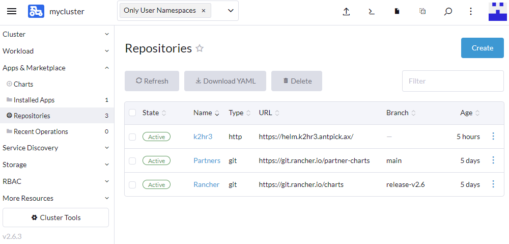  
（上記の図では、既に同じAntpickax製品の`K2HR3 Helm Chart`が登録されています。）  

このページにある **Create** ボタンをクリックして、**K2HDKC Helm Chart** をリポジトリとして登録します。

**Create** ボタンをクリックすると、以下に示す **Repository: Create**のページが表示されます。  

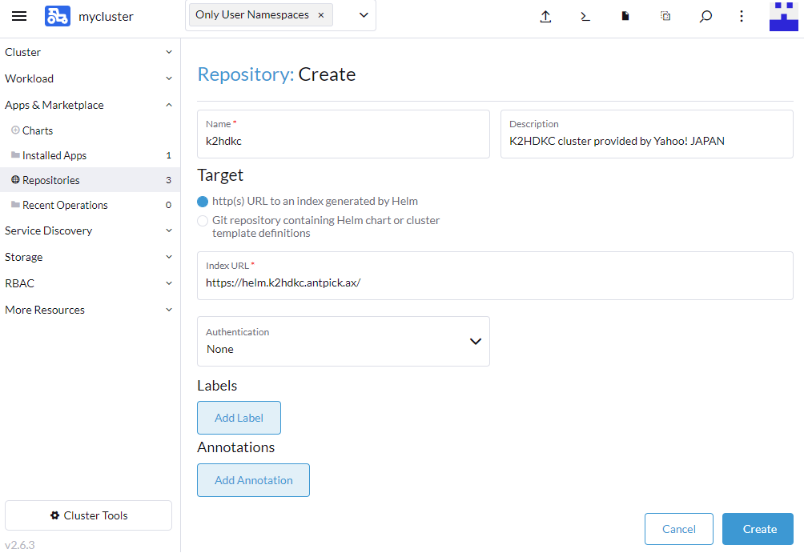  

**K2HDKC Helm Chart** をリポジトリとして登録するために、以下の項目（必須）へ値を設定します。  

- Name  
`k2hr3` を入力してください。
- Target  
`http(s) URL to an index generated by Helm` を選択します。
- index URL  
`https://helm.k2hdkc.antpick.ax/` を入力します。

上記の値を設定した後、**Create** ボタンをクリックします。  

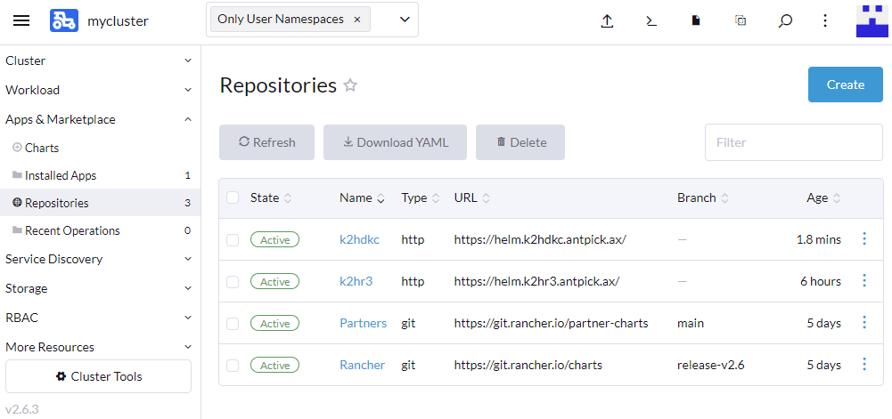  

以上で、上記に示すように、**K2HDKC Helm Chart** をRANCHERのリポジトリとして登録できました。  

## Chartインストール
次に、**K2HDKC Helm Chart** をインストールします。  

左ペインの、`Apps & Marketplace` > `Charts` を選択すると、利用できる `Chart`の一覧が表示されます。  

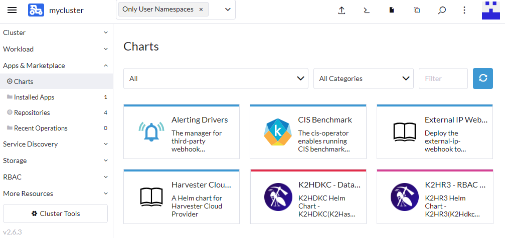  

この Chart リストの中から `K2HDKC` のChartを見つけてください。  

リストの `K2HDKC` をクリックすると、**K2HDKC Helm Chart** をインストールためのページが表示されます。  

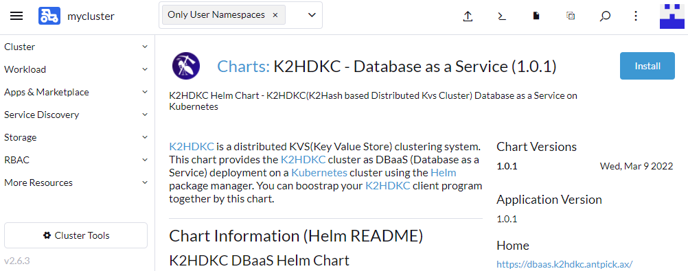  

右上にある **Install** ボタンをクリックして次に進みます。  

### Chartインストール : Step 1
以下のように、`Install: Step 1` のページが表示されます。  

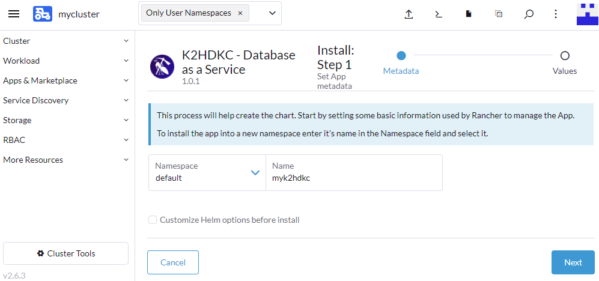  

このステップでは、インストールするK2HDKCクラスターの `名前` を入力してください。
上記の例では、`Name` に `myk2hdkc` を入力しています。

入力したら、**Next** ボタンをクリックします。  

### Chartインストール : Step 2
以下のように、`Install: Step 2` のページが表示されます。  

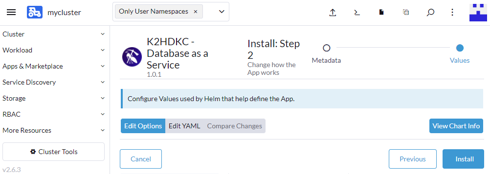  

このステップでは、以下の項目の設定をします。  
- 利用するK2HR3システムの設定
- K2HDKCクラスターサーバの設定
- K2HDKCクラスタークライアント（スレーブ）の設定

それぞれの設定について、説明します。  

#### K2HR3システムの設定
`Install: Step 2` ページ で、`Edit Option`を選択し、リストから `K2HR3 System to use` を選択します。  

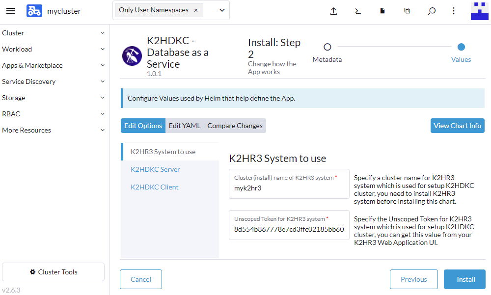  

**K2HDKC Helm Chart** を使い、K2HDKCクラスターを構築するためには、K2HR3システムが必要です。  
この設定では、利用するK2HR3システムの情報を入力します。  

利用する **K2HR3システム** は、同じ [AntPickax](https://antpick.ax/indexja.html) が提供する [K2HR3 Helm Chart](https://k2hr3.antpick.ax/rancher_helm_chartja.html)を使って、簡単に構築できます。  
[K2HR3 Helm Chart](https://k2hr3.antpick.ax/rancher_helm_chartja.html)も、**K2HDKC Helm Chart** と同様に、[RANCHER](https://www.rancher.co.jp/) からK2HR3システム構築ができます。  
[K2HR3 Helm Chart with RANCHER](https://k2hr3.antpick.ax/rancher_helm_chartja.html)を参照して、このK2HDKCクラスターを**構築する前に**、K2HR3システムを構築しておいてください。  

この設定では、以下の必須項目を入力します。  
- Cluster(install) name of K2HR3 system
- Unscoped Token for K2HR3 system

#### Cluster(install) name of K2HR3 system
[K2HR3 Helm Chart with RANCHER](https://k2hr3.antpick.ax/rancher_helm_chartja.html)の手順で、K2HR3システムを構築したときに指定した K2HR3システムの `Name`（名前）を指定します。  
[K2HR3 Helm Chart with RANCHER](https://k2hr3.antpick.ax/rancher_helm_chartja.html)の例では、`myk2hr3` を指定してます。  

#### Unscoped Token for K2HR3 system
利用するK2HR3システムの `K2HR3 Web Application` にサインインし、ユーザの`Unscoped Token`を指定します。  

`Unscoped Token`は以下の手順で、取得できます。  
- `K2HR3 Web Application`にサインインします。
- 右上の`アカウントボタン`をクリックし、`ユーザアカウント情報`を選択します。
- `アカウント情報`ダイアログの`トークン`に、`Unscoped Token`が表示されます。

以下に、`アカウント情報`ダイアログを示します。  
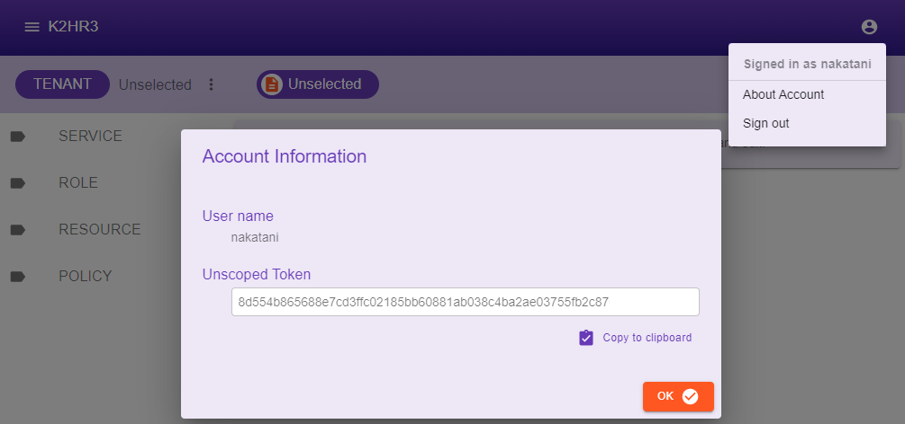  

これら必須項目を入力したら、`K2HR3 System to use`設定の入力は完了です。  

#### K2HDKCクラスターサーバの設定
`Install: Step 2` ページ で、`Edit Option`を選択し、リストから `K2HDKC Server` を選択します。  

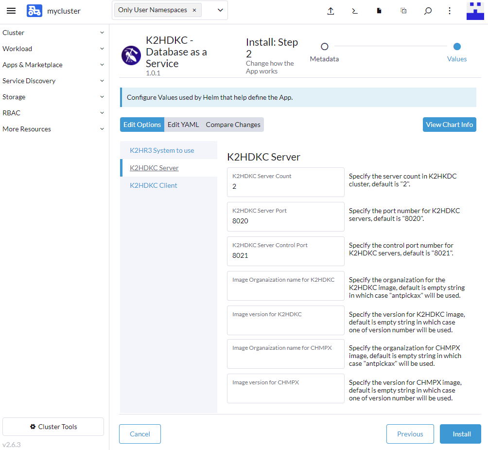  

この設定では、K2HDKCクラスターサーバの情報を入力します。  
この設定は、以下の項目を入力しますが、必須の入力ではありません。  
- K2HDKC Server Count
- K2HDKC Server Port
- K2HDKC Server Control Port
- Image Organaization name for K2HDKC
- Image version for K2HDKC
- Image Organaization name for CHMPX
- Image version for CHMPX

各々の項目の説明を参照し、必要な項目に値を設定してください。  

これら必須項目を入力したら、`K2HDKC Server`設定の入力は完了です。  

#### K2HDKCクラスタークライアント（スレーブ）の設定
`Install: Step 2` ページ で、`Edit Option`を選択し、リストから `K2HDKC Client` を選択します。  

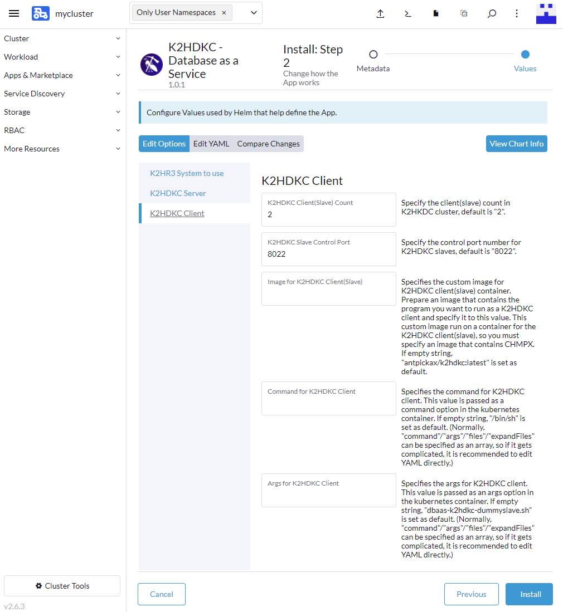  

この設定では、K2HDKCクラスターのクライアント（スレーブ）の情報を入力します。  
この設定は、以下の項目を入力しますが、必須の入力ではありません。  
- K2HDKC Client(Slave) Count
- K2HDKC Slave Control Port
- Image for K2HDKC Client(Slave)
- Command for K2HDKC Client
- Args for K2HDKC Client

各々の項目の説明を参照し、必要な項目に値を設定してください。  

この設定には、ユーザのクライアントのための項目があります。  
デフォルトの値のままだと、K2HDKCクライアントのためのコンテナーは、何もしません。  
ユーザは、K2HDKCクライアントとして自分に必要なプログラムを配置し、起動することができます。  
そのために、`Image for K2HDKC Client(Slave)`、`Command for K2HDKC Client`、`Args for K2HDKC Client`の3つの項目を指定できます。  

各項目には、[こちら](https://k2hr3.antpick.ax/helm_chartja.html)を参考にして、値を設定してください。  

この説明では、上記の値を入力せず（変更せず）、デフォルトのままで進めます。  

これら必須項目を入力したら、`K2HDKC Client`設定の入力は完了です。  

## Chartインストール完了
**K2HDKC Helm Chart** をインストールが開始され、完了すると以下の画面（`Apps & Marketplace` > `Installed Apps`）が表示されます。

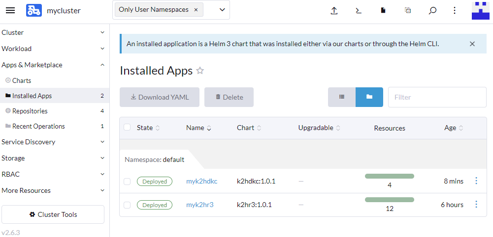  

`Deployed` バッジが表示されていれば、K2HDKCクラスターの構築が成功しています。  

kubernetesの各サービスの状態を確認します。

### StatefulSets
**K2HDKC Helm Chart** がインストールした `StatefulSets` を表示します。  
左ペインの、`Workload` > `StatefulSets` を選択して確認します。  

  

`slvpod-myk2hdkc` と `svrpod-myk2hdkc`（`Name=myk2hdkc`の場合） が表示され、`Active` バッジが表示されていれば、`StatefulSets`は成功しています。  

### Pods
**K2HDKC Helm Chart** がインストールした `Pods` を表示します。  
左ペインの、`Workload` > `Pods` を選択して確認します。  

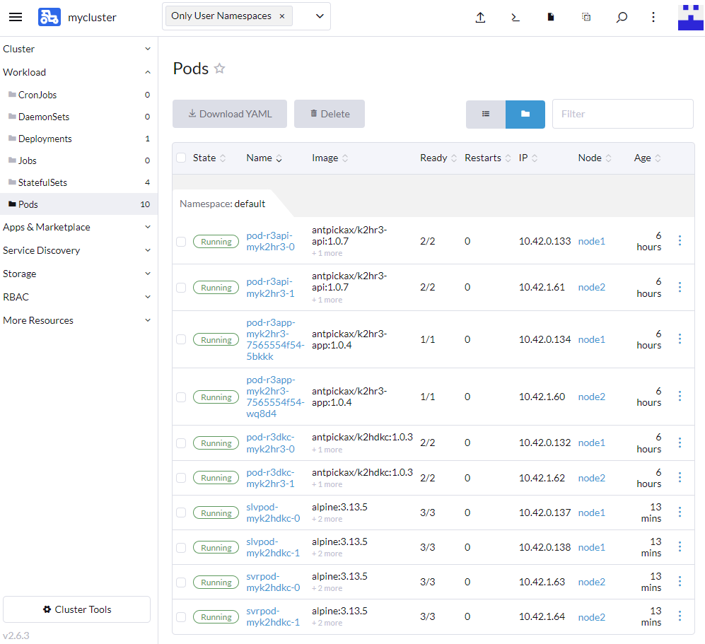  

`slvpod-myk2hdkc-[0,1]` と `svrpod-myk2hdkc-[0,1]`（`Name=myk2hdkc`の場合）の合計4つのPod が表示され、`Running` バッジが表示されていれば、`Pods`は成功しています。  

## 動作確認
構築したK2HDKCクラスターの動作確認をします。  

動作確認には、[RANCHER](https://www.rancher.co.jp/) UIを使えます。  
以下の手順では、[RANCHER](https://www.rancher.co.jp/) UI から起動したK2HDKCクラスターのクライアント（スレーブ）のコンテナーでシェルを起動します。

### シェルの起動
まず、起動したK2HDKCクライアント（スレーブ）の Pod を一つ選択し、その内容を表示します。  
前述のPods一覧の表示から、クライアント（スレーブ）用のPod名（`slvpod-<name>-<number>`）の一つをクリックします。  
以下の例では、`slvpod-myk2hdkc-0`の内容を表示しています。  

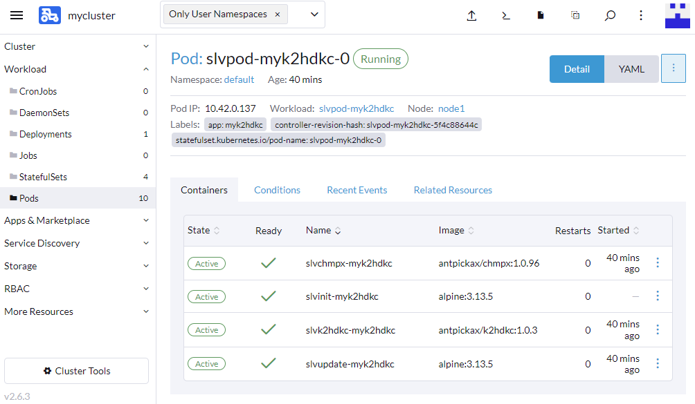  

上記のコンテナーリストの中から、クライアントプログラム実行用のコンテナー（`slvk2hdkc-<name>`）を選択します。  
このコンテナーの右側のボタンをクリックし、メニューから `Execute Shell` を選択します。  

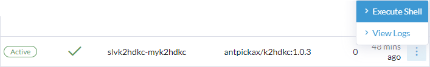  

上記のメニューを選択すると、以下の画面に示すようにコンテナーのシェル画面が表示されます。  
画面の下部に **シェルのプロンプト**（`/ # `） が表示されていることを確認してください。  

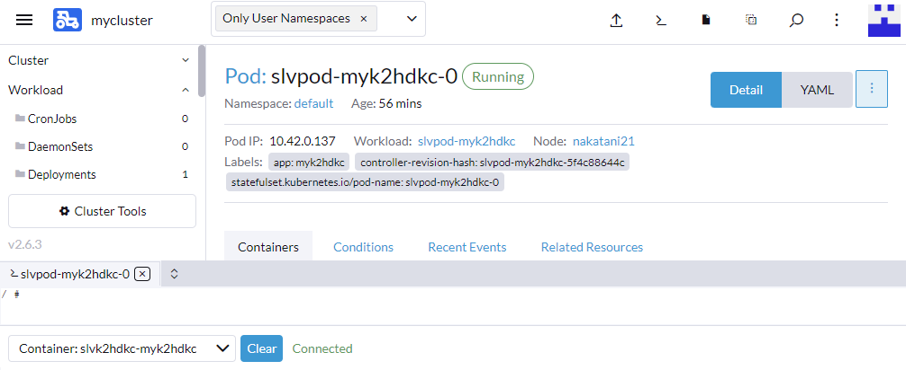  

この後、シェルから `k2hdkclinetool` を起動し、K2HDKCクラスターの動作確認をします。  

#### k2hdkclinetoolテスト
`k2hdkclinetool`が起動したら、以下の **k2hdkclinetoolコマンド** を実行し、`K2HDKCクラスターの状態`、`CHMPXクラスターの状態`、`データの読み書き` を確認します。  
`k2hdkclinetool`の使い方は、[こちら](https://k2hdkc.antpick.ax/k2hdkclinetoolja.html)を参照してください。  

- `k2hkdclinetool`を起動します。  
```
/ # k2hdkclinetool -conf /etc/antpickax/slave.ini
    -------------------------------------------------------
     K2HDKC LINE TOOL
    -------------------------------------------------------
    K2HDKC library version          : 1.0.3
    K2HDKC API                      : C++
    Communication log mode          : no
    Debug mode                      : silent
    Debug log file                  : not set
    Print command lap time          : no
    Command line history count      : 1000
    Chmpx parameters:
        Configuration               : /etc/antpickax/slave.ini
        Control port                : 0
        CUK                         : 
        Permanent connect           : no
        Auto rejoin                 : no
        Join giveup                 : no
        Cleanup backup files        : yes
    -------------------------------------------------------
K2HDKC>
```

- K2HDKCクラスターの状態を確認します。  
```
K2HDKC> status node
        K2HDKC server node count                       = 2
        <    chmpxid   >[<  base hash   >](      server name      ) : area element page (k2hash size/ file size )
        ----------------+-----------------+-------------------------:-----+-------+----+-------------------------
        1fa555daf4e4218f[0000000000000001](svrpod-myk2hdkc-1.svrsvc-myk2hdkc.default.svc.cluster.local) :   0%      0%   0% (298905600 / 298905600)
        1fa5578df4e4218f[0000000000000000](svrpod-myk2hdkc-0.svrsvc-myk2hdkc.default.svc.cluster.local) :   0%      0%   0% (298905600 / 298905600)
```

- CHMPXクラスターの状態を確認します。  
```
K2HDKC> status chmpx
        ALL CHMPX STATUS(SIMPLE)
        
        chmpx process id             = 247
        random mode                  = no
        chmpx name                   = myk2hdkc
        self chmpx = {
          chmpxid                    = 0xf708ad7307a14571
          hostname                   = slvpod-myk2hdkc-0.slvsvc-myk2hdkc.default.svc.cluster.local
          mode                       = slave
          port                       = -1
          control port               = 8022
          cuk                        = eyJrOHNfY29udGFpbmVyX2lkIjoiODAxZTE1ZDg5NDRjNTg2ZmIw...
          custom id seed             = slvpod-myk2hdkc-0
          endpoints                  = 
          control endpoints          = 
          forward peers              = 
          reverse peers              = 
          ssl                        = no
          last status update time    = 27630419226733433 (unix time)
          status                     = SAFE -> [SLAVE][UP][n/a][Nothing][NoSuspend]
        }
        server chmpxs [ 2 ] = {
          [0] = {
            chmpxid                  = 0x1fa5578df4e4218f
            hostname                 = svrpod-myk2hdkc-0.svrsvc-myk2hdkc.default.svc.cluster.local
            mode                     = server
            port                     = 8020
            control port             = 8021
            cuk                      = eyJrOHNfY29udGFpbmVyX2lkIjoiOTI0NTY5OWE3NDFlZjU3MjVh...
            custom id seed           = svrpod-myk2hdkc-0
            endpoints                = 
            control endpoints        = 
            forward peers            = 
            reverse peers            = 
            ssl                      = yes
            last status update time  = 27630491553690831 (unix time)
            status                   = SAFE -> [SERVICE IN][UP][n/a][Nothing][NoSuspend]
          }
          [1] = {
            chmpxid                  = 0x1fa555daf4e4218f
            hostname                 = 10-42-1-64.slvsvc-myk2hdkc.default.svc.cluster.local
            mode                     = server
            port                     = 8020
            control port             = 8021
            cuk                      = eyJrOHNfY29udGFpbmVyX2lkIjoiMWQ3Nzg4NjMyNTJkN2EyYWU3...
            custom id seed           = svrpod-myk2hdkc-1
            endpoints                = 
            control endpoints        = 
            forward peers            = 
            reverse peers            = 
            ssl                      = yes
            last status update time  = 27630491553690831 (unix time)
            status                   = SAFE -> [SERVICE IN][UP][n/a][Nothing][NoSuspend]
          }
        }
        slave chmpxs [ 0 ] = {
        }
        chmpx using MQ               = 8
        client process using MQ      = 0
        assigned MQ                  = 0
```

- データの読み書きをテストします。  
```
K2HDKC> set testkey testvalue
K2HDKC> print testkey
        "testkey" => "testvalue"
```

以上のように、K2HDKCクラスターの状態、データの読み書きに問題がなければ、K2HDKCクラスターは正常に起動しています。  

## 最後に
以上で、[RANCHER](https://www.rancher.co.jp/) と **K2HDKC Helm Chart** を使い、K2HDKCクラスターを構築できます。  

上記例では、必須項目のみを設定してK2HDKCクラスターを構築しましたが、もっとカスタマイズすることができます。
`Chartインストール : Step 2` で表示されている項目以外をカスタマイズする場合は、`Edit YAML`を選択して、直接 **K2HDKC Helm Chart** の`values.yaml`の値を編集できます。  

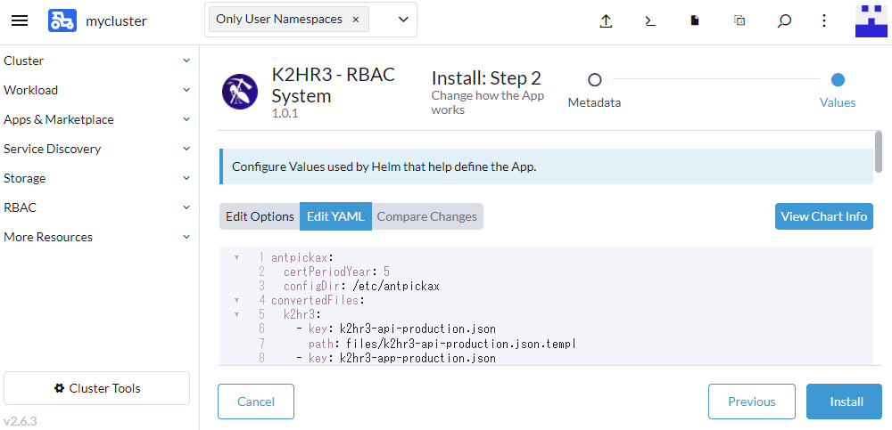  

変更できる値は、`heml`コマンドを使って **K2HDKC Helm Chart** をカスタマイズする場合と同じです。  
各変数の定義、デフォルト値は、[K2HDKC Helm Chart オプション](usage_helm_chartja.html)を参照してください。  

以上のように、**K2HDKC Helm Chart** を **RANCHER Helm Chart** として[RANCHER](https://www.rancher.co.jp/)で利用すれば、簡単に K2HDKCクラスターを構築できます。  
